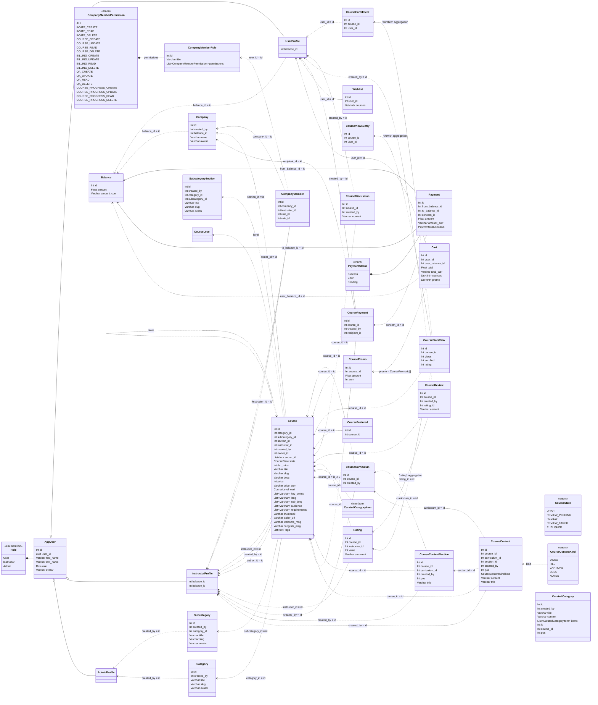

```mermaid
classDiagram
direction RL

class UserProfile
UserProfile: Int balance_id

class InstructorProfile
InstructorProfile: Int balance_id

class AdminProfile
InstructorProfile: Int balance_id

class AppUser
AppUser: Int id
AppUser: uuid user_id
AppUser: Varchar first_name
AppUser: Varchar last_name
AppUser: Role role
%% // TODO: decide on a proper type
AppUser: Varchar avatar

class Role { <<enumeration>> }
Role: User
Role: Instructor
Role: Admin

class Company
Company: Int id
Company: Int created_by
Company: Int balance_id
Company: Varchar name
Company: Varchar avatar

class CompanyMember
CompanyMember: Int id
CompanyMember: Int company_id
CompanyMember: Int instructor_id
CompanyMember: Int role_id
CompanyMember: Int role_id

class CompanyMemberRole
CompanyMemberRole: Int id
CompanyMemberRole: Varchar title
CompanyMemberRole: List~CompanyMemberPermission~ permissions

class CompanyMemberPermission { <<enum>> }
CompanyMemberPermission: ALL
CompanyMemberPermission: INVITE_CREATE
CompanyMemberPermission: INVITE_READ
CompanyMemberPermission: INVITE_DELETE
CompanyMemberPermission: COURSE_CREATE
CompanyMemberPermission: COURSE_UPDATE
CompanyMemberPermission: COURSE_READ
CompanyMemberPermission: COURSE_DELETE
CompanyMemberPermission: BILLING_CREATE
CompanyMemberPermission: BILLING_UPDATE
CompanyMemberPermission: BILLING_READ
CompanyMemberPermission: BILLING_DELETE
CompanyMemberPermission: QA_CREATE
CompanyMemberPermission: QA_UPDATE
CompanyMemberPermission: QA_READ
CompanyMemberPermission: QA_DELETE
CompanyMemberPermission: COURSE_PROGRESS_CREATE
CompanyMemberPermission: COURSE_PROGRESS_UPDATE
CompanyMemberPermission: COURSE_PROGRESS_READ
CompanyMemberPermission: COURSE_PROGRESS_DELETE

class Balance
Balance: Int id
Balance: Float amount
Balance: Varchar amount_curr

class Category
Category: Int id
Category: Int created_by
Category: Varchar title
Category: Varchar slug
Category: Varchar avatar

class Subcategory
Subcategory: Int id
Subcategory: Int created_by
Subcategory: Int category_id
Subcategory: Varchar title
Subcategory: Varchar slug
Subcategory: Varchar avatar

class SubcategorySection
SubcategorySection: Int id
SubcategorySection: Int created_by
SubcategorySection: Int category_id
SubcategorySection: Int subcategory_id
SubcategorySection: Varchar title
SubcategorySection: Varchar slug
SubcategorySection: Varchar avatar

class Course
Course: Int id
Course: Int category_id
Course: Int subcategory_id
Course: Int section_id
Course: Int instructor_id
Course: Int created_by
Course: Int owner_id
Course: List~Int~ author_id
Course: CourseState state
Course: Int dur_mins
Course: Varchar title
Course: Varchar slug
Course: Varchar desc
Course: Int price
Course: Varchar price_curr
Course: CourseLevel level
Course: List~Varchar~ key_points
Course: List~Varchar~ lang
Course: List~Varchar~ sub_lang
Course: List~Varchar~ audience
Course: List~Varchar~ requirements
Course: Varchar thumbnail
Course: Varchar trailer_url
Course: Varchar welcome_msg
Course: Varchar congrats_msg
Course: List~Int~ tags

class CourseState { <<enum>> }
CourseState : DRAFT
CourseState : REVIEW_PENDING
CourseState : REVIEW
CourseState : REVIEW_FAILED
CourseState : PUBLISHED

class CourseCurriculum
CourseCurriculum: Int id
CourseCurriculum: Int course_id
CourseCurriculum: Int created_by

class CourseContentSection
CourseContentSection: Int id
CourseContentSection: Int course_id
CourseContentSection: Int curriculum_id
CourseContentSection: Int created_by
CourseContentSection: Int pos
CourseContentSection: Varchar title

class CourseContent
CourseContent: Int id
CourseContent: Int course_id
CourseContent: Int curriculum_id
CourseContent: Int section_id
CourseContent: Int created_by
CourseContent: Int pos
CourseContent: CourseContentKind kind
CourseContent: Varchar content
CourseContent: Varchar title

class CourseContentKind { <<enum>> }
CourseContentKind: VIDEO
CourseContentKind: FILE
CourseContentKind: CAPTIONS
CourseContentKind: DESC
CourseContentKind: NOTES

class CourseDiscussion
CourseDiscussion: Int id
CourseDiscussion: Int course_id
CourseDiscussion: Int created_by
CourseDiscussion: Varchar content

class CourseReview
CourseReview: Int id
CourseReview: Int course_id
CourseReview: Int created_by
CourseReview: Int rating_id
CourseReview: Varchar content

class CourseFeatured
CourseFeatured: Int id
CourseFeatured: Int course_id

class CourseStatsView
CourseStatsView: Int id
CourseStatsView: Int course_id
CourseStatsView: Int views
CourseStatsView: Int enrolled
CourseStatsView: Int rating

class CourseViewsEntry
CourseViewsEntry: Int id
CourseViewsEntry: Int course_id
CourseViewsEntry: Int user_id

class Rating
Rating: Int id
Rating: Int course_id
Rating: Int instructor_id
Rating: Int value
Rating: Varchar comment

class CourseEnrollment
CourseEnrollment: Int id
CourseEnrollment: Int course_id
CourseEnrollment: Int user_id

class CoursePromo
CoursePromo: Int id
CoursePromo: Int course_id
CoursePromo: Float amount
CoursePromo: Int curr

class CuratedCategory
CuratedCategory: Int id
CuratedCategory: Int created_by
CuratedCategory: Varchar title
CuratedCategory: Varchar content
CuratedCategory: List~CuratedCategoryItem~ items

class CuratedCategoryItem { <<interface>> }
CuratedCategory: Int id
CuratedCategory: Int course_id
CuratedCategory: Int pos

class Payment
Payment: Int id
Payment: Int from_balance_id
Payment: Int to_balance_id
Payment: Int concern_id
Payment: Float amount
Payment: Varchar amount_curr
Payment: PaymentStatus status

class PaymentStatus { <<enum>> }
PaymentStatus: Success
PaymentStatus: Error
PaymentStatus: Pending

class CoursePayment
CoursePayment: Int id
CoursePayment: Int course_id
CoursePayment: Int created_by
CoursePayment: Int recipient_id

class Wishlist
Wishlist: Int id
Wishlist: Int user_id
Wishlist: List~Int~ courses

class Cart
Cart: Int id
Cart: Int user_id
Cart: Int user_balance_id
Cart: Float total
Cart: Varchar total_curr
Cart: List~Int~ courses
Cart: List~Int~ promo

%% --- --- ---
%% RELATIONS
%% --- --- ---

AppUser ..* Role
UserProfile --|> AppUser
InstructorProfile --|> AppUser
AdminProfile --|> AppUser
UserProfile ..> Balance : balance_id = id

Company ..> Balance: balance_id = id
CompanyMember ..> Company: company_id = id
CompanyMember ..> InstructorProfile: instructor_id = id
CompanyMember ..> InstructorProfile: instructor_id = id
CompanyMember ..> CompanyMemberRole: role_id = id
CompanyMemberRole ..* CompanyMemberPermission: permissions

Subcategory ..> AdminProfile : created_by = id
Category ..> AdminProfile : created_by = id
Course ..> Category : category_id = id
Course ..> Subcategory : subcategory_id = id
Course ..> InstructorProfile : instructor_id = id
Course ..> InstructorProfile : created_by = id
Course ..> InstructorProfile : author_id = id
Course ..> Company : owner_id = id
Course ..> SubcategorySection : section_id = id
Course ..> CourseLevel : level
Course ..> Course : state
CourseCurriculum ..> Course : course_id = id
CoursePromo ..> Course : course_id = id
CourseStatsView ..> Course : course_id = id
CourseFeatured ..> Course : course_id = id
CourseEnrollment ..> UserProfile : user_id = id
CourseDiscussion ..> Course : course_id = id
CourseReview ..> Course : course_id = id
CourseDiscussion ..> UserProfile : created_by = id
CourseReview ..> UserProfile : created_by = id
CourseReview ..> Rating : rating_id = id
Rating ..> Course : course_id = id
Rating ..> InstructorProfile : instructor_id = id
CourseStatsView ..> Rating : "rating" aggregation
CourseStatsView ..> CourseEnrollment : "enrolled" aggregation
CourseStatsView ..> CourseViewsEntry : "views" aggregation
CuratedCategoryItem ..> Course : course_id = id

CourseCurriculum ..> Course : course_id = id
CourseCurriculum ..> InstructorProfile : created_by = id
CourseContentSection ..> Course : course_id = id
CourseContentSection ..> CourseCurriculum : curriculum_id = id
CourseContentSection ..> InstructorProfile : created_by = id
CourseContent ..> Course : course_id = id
CourseContent ..> CourseCurriculum : curriculum_id = id
CourseContent ..> CourseContentSection : section_id = id
CourseContent ..> InstructorProfile : created_by = id
CourseContentKind ..> CourseContent : kind

Payment --* PaymentStatus
Payment --> Balance : from_balance_id = id
Payment --> Balance : to_balance_id = id
Payment ..> CoursePayment: concern_id = id
CoursePayment ..> Course : course_id = id
CoursePayment ..> UserProfile : created_by = id
CoursePayment ..> Company : recipient_id = id

Wishlist ..> UserProfile : user_id = id
Cart ..> UserProfile : user_id = id
Cart ..> Balance : user_balance_id = id
Cart ..> CoursePromo : promo = CoursePromo.id[]

```
